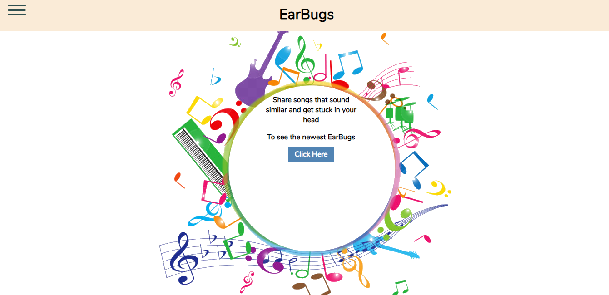
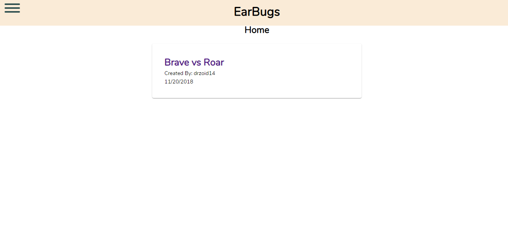

# EarBugs 

[Try it here](https://whispering-island-53296.herokuapp.com "EarBugs")

EarBugs is a site where you can pair up songs that sound the same to play their similar sections and listen to them side by side.

## Tech Used

We used React, Redux, HTML, CSS, Node, Mongo, Express, Mongoose, mLab, Heroku, and Travis to help build this app