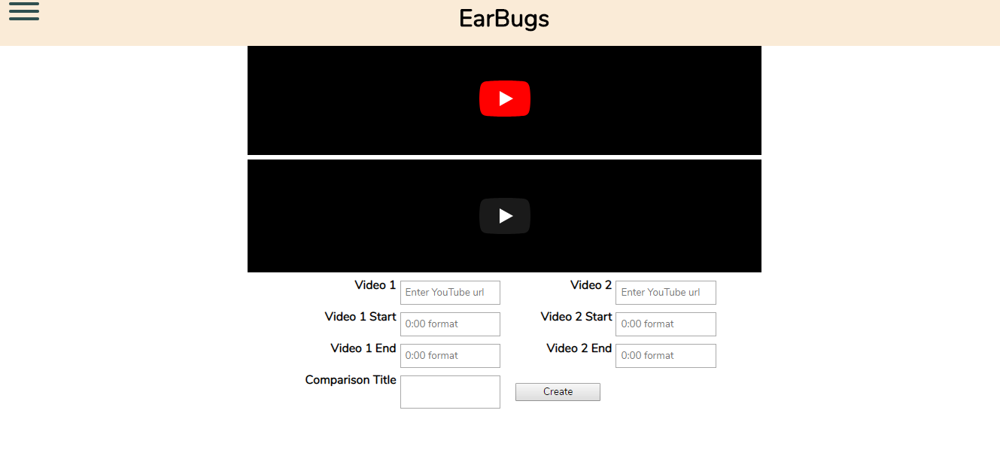

# EarBugs 

[Try it here](https://whispering-island-53296.herokuapp.com "EarBugs")

EarBugs is a site where you can pair up songs that sound the same to play their similar sections and listen to them side by side.

In the creation tab, it is necessary to use 0:00 format for the time 

## API Documentation
This app uses a simple Create, Read, Update, Delete (CRUD)API that is managed on a separate server Repo. Authentication is handled by using JSON Web Tokens kept on local storage. With the logout button you are returned to the home page and the local storage is cleared.

## Tech Used

### Front End
React and Redux were the main components to building the front end of this page, using vanilla CSS for the styling.

### Back End
The database is managed using Mongo and mLab

### Testing
Testing for the front end was completed using Jest, while Mocha and Chai were used for testing the back end.  Travis is used for testing continuous integration

